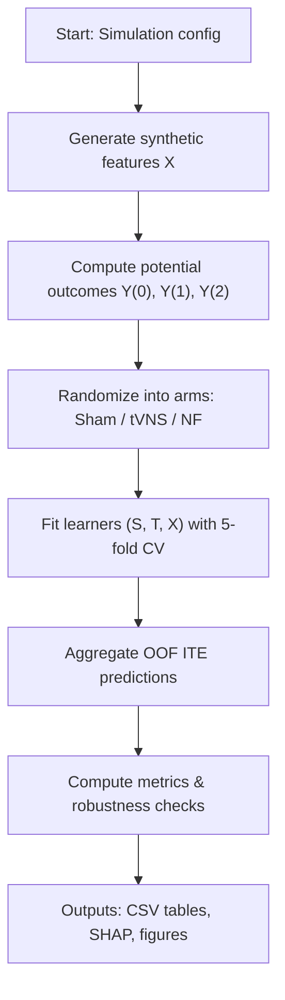
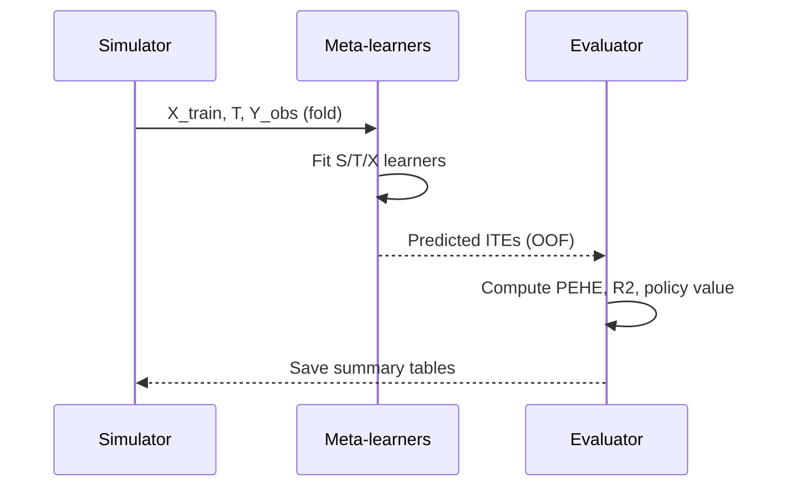

# individualized-treatment

Framework benchmark for individualized neuromodulation

## Overview

This repository implements a three-arm simulation and evaluation framework for
individualized treatment selection in non-invasive neuromodulation. The
simulation generates a synthetic multimodal dataset (EEG, HRV, psychometrics,
age, sex) and three potential outcomes per unit for Sham (control), tVNS, and
Neurofeedback (NF). The goal is to evaluate meta-learners (S-, T-, and
X-learners) for recovering individualized treatment effects (ITEs) and for
policy evaluation (choosing the best treatment per individual).

Key features:

- Synthetic DGP with interpretable prognostic and treatment-effect components
- Three-arm setup: `Sham` (0), `tVNS` (1), `NF` (2)
- Implementations of S-learner, T-learner, and an X-learner adapted for three
	arms (Sham as reference)
- Out-of-fold evaluation with PEHE, R2-ITE, calibration slopes, and policy
	metrics
- Robustness checks (outcome noise, MCAR missingness) and SHAP variable
	importance for the comparative effect

## Files

- `simulation 3arm.py`: main simulation & evaluation script (entry point)
- `synthetic dataset.csv`: example output (if present)
- `assets/three_arm_diagram.svg`: illustrative diagram describing data flow

## Design / Data-generating process (DGP)

- Sample size: default n = 810 (270 per arm)
- Features: 42 (20 EEG-like, 10 HRV-like, 10 psychometric, Age, Sex)
- Prognostic function b(X) uses EEG slices, HRV, psychometrics, age, sex
- Conditional treatment effects:
	- τ_NF(X) = 0.80·EEG_[8:11] + 0.30·PSY_[1:3] + η_NF
	- τ_tVNS(X) = −0.70·HRV_[1:3] + 0.20·PSY_[1:3] + η_tVNS

Observed outcome is Y = b(X) + τ_T(X) + ε_T where ε and η are noise terms

## How the pipeline works

1. Generate synthetic cohort with `generate_synthetic_dataset`.
2. Randomize subjects 1:1:1 into Sham / tVNS / NF arms.
3. Compute potential outcomes Y(0), Y(1), Y(2) and ground-truth ITEs.
4. Run 5-fold stratified CV; fit S-, T-, and X-learners on each fold.
5. Aggregate out-of-fold ITE predictions and compute metrics (PEHE, R2,
	 calibration slopes, assignment accuracy, policy value).
6. Run robustness analyses and (optionally) SHAP feature rankings for the
	 comparative effect.

## Mermaid diagrams (conceptual)

Flowchart (high-level):



Sequence (data → decision):



## Quick usage

To run the simulation and write outputs to a folder, run:

```bash
python3 "simulation 3arm.py"
```

By default the script will write several CSV outputs (see top of
`run_simulation` in the script):

- `synthetic_dataset_3arm.csv`
- `model_performance_summary_3arm.csv`
- `bootstrap_cis_xlearner_3arm.csv`
- `noise_robustness_xlearner_3arm.csv`
- `missingness_robustness_xlearner_3arm.csv`
- `shap_rankings_3arm.csv` (if `shap` is installed)
- `sanity_checks_3arm.csv`

## Key metrics explained

- PEHE: root mean squared error between predicted and true unit-level ITEs
- R2-ITE: coefficient of determination for recovered ITEs
- Calibration slope: slope from regressing true ITE on predicted ITE
- Assignment accuracy (3-way): fraction of units where predicted best-arm
	matches the realised best-arm
- Policy value / regret: average outcome under the learned policy vs oracle

## Visualization

An illustrative diagram is included at `assets/three_arm_diagram.svg`.

## Extending / reproducing

- Change DGP or sample sizes by editing `SimulationConfig` in
	`simulation 3arm.py`.
- Swap base learners by replacing `make_gb` with other regressors (ensure
	they expose the same `predict` API).
- Install `shap` to enable feature-importance rankings: `pip install shap`.

## Contact / Author

Author: Seyedeh Zeinab Molaeizadeh

---

If you'd like I can:

- generate PNG/JPEG renderings of the Mermaid diagrams and embed them,
- add a runnable `requirements.txt` and a small example script to run a
	trimmed simulation for quick testing.


